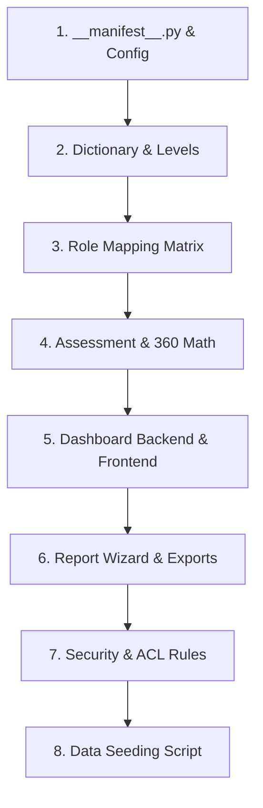

# 🏛️ Bunna Bank ERP — Competency Management Suite
## Technical File Reading Order, Architecture Guide & Module Highlights

> **Author**: Google DeepMind / Antigravity AI Pair Programmer  
> **Date**: September 2026  
> **Target Module**: `competency_management` (`omni-bank-erp/custom_addons/competency_management`)  
> **System Scope**: Bunna Bank S.C. Integrated Competency Framework, 360° Multi-Rater Assessment Engine, TNA Analytics, & Decision Support Suite  

---

## 📖 Executive Summary & Highlights

The **Competency Management Suite** is an enterprise-grade Odoo 19 module built specifically for **Bunna Bank S.C.** It operationalizes the bank's **Integrated Competency Framework**, supporting **1,567 job positions**, **3 competency pillars** (Core, Leadership, Technical), and **4 proficiency levels** (Level 1 Basic to Level 4 Expert).

### ✨ Key Features & Capabilities:
* 🌐 **OWL Interactive Decision Support Dashboard**: Real-time decision-support interface featuring active campaign header banners, 5 top-level KPI cards, interactive Chart.js visualizations (TNA Donut, Grouped Pillar Gaps, Spider/Radar Target Profiles), and a dynamic Department Heatmap Matrix.
* 🔐 **Operating Unit & Persona Boundary Isolation**: Enforces strict Operating Unit (Branch/District/Head Office) data boundaries. Non-admin managers only see staff and workunits within their assigned Operating Units. Persona pills (`Executive`, `Manager`, `Employee`) dynamically adjust visibility based on supervisory roles.
* 🔄 **360° Multi-Rater Weighted Evaluation Engine**: Computes weighted competency ratings combining **Self**, **Peer**, **Subordinate**, **Supervisor**, and **Team** ratings using configurable weighting formulas:
  $$\text{Weighted Level} = \frac{\text{Self} \times w_{\text{self}} + \text{Peer} \times w_{\text{peer}} + \text{Sub} \times w_{\text{sub}} + \text{Sup} \times w_{\text{sup}} + \text{Team} \times w_{\text{team}}}{w_{\text{self}} + w_{\text{peer}} + w_{\text{sub}} + w_{\text{sup}} + w_{\text{team}}}$$
* 📊 **Enterprise Report Generator**: Form view with cascading filters (`Department` $\rightarrow$ `Workunit/Branch` $\rightarrow$ `Job Position` $\rightarrow$ `Employee`), multi-format exports (PDF, Excel, CSV), and custom QWeb printing.
* 👤 **Personalized "My Evaluations" Portal**: Dedicated navigation area where employees view their live evaluated competency breakdown, weighted gap scores, and behavioral level guidelines.

---

## 🗺️ Recommended File Reading Order

To understand the codebase thoroughly, follow this logical sequence from configuration and foundational models up to UI controllers and security policies:

---

### Step 1: Manifest & Matrix Configuration
* 📜 [`__manifest__.py`](file:///d:/Bunna/Projects/ERP/omni-bank-erp/custom_addons/competency_management/__manifest__.py)
  * **What to look for**: Dependencies (`base`, `hr`, `mail`, `portal`, `hr_employee_custom`), data loading order, and web assets bundle (`web.assets_backend`).
* 📜 [`models/competency_matrix_config.py`](file:///d:/Bunna/Projects/ERP/omni-bank-erp/custom_addons/competency_management/models/competency_matrix_config.py)
  * **What to look for**: Global settings model `competency.matrix.config`. Stores 360 evaluator weights (`weight_self`, `weight_peer`, `weight_supervisor`, etc.), proficiency determinant modes (`job_grade` vs `job_position`), and fallback behavioral level indicators.

---

### Step 2: Competency Dictionary & Level Framework
* 📜 [`models/competency_competency.py`](file:///d:/Bunna/Projects/ERP/omni-bank-erp/custom_addons/competency_management/models/competency_competency.py)
  * **What to look for**:
    * `competency.competency`: Master dictionary model (code, name, pillar, functional domain, rating model).
    * `competency.proficiency.level`: Defines Levels 1 to 4 with mandatory behavioral indicators (`indicator_level_1` to `indicator_level_4`).
    * `competency.cluster`: Grouping of related competencies.

---

### Step 3: Role-Competency Mapping Matrix
* 📜 [`models/competency_role_mapping.py`](file:///d:/Bunna/Projects/ERP/omni-bank-erp/custom_addons/competency_management/models/competency_role_mapping.py)
  * **What to look for**:
    * `competency.role.mapping`: Maps job positions (`hr.job`) and grades (`employee.grade`) to expected target proficiency levels.
    * `competency.role.mapping.line`: Individual target requirements per competency for a specific role. Supports Operating Unit-specific overrides.
* 📜 [`views/competency_role_mapping_views.xml`](file:///d:/Bunna/Projects/ERP/omni-bank-erp/custom_addons/competency_management/views/competency_role_mapping_views.xml)
  * **What to look for**: Form views, approval buttons (`action_approve`), and clone wizard triggers.

---

### Step 4: Assessment Engine & 360 Multi-Rater Math
* 📜 [`models/competency_assessment.py`](file:///d:/Bunna/Projects/ERP/omni-bank-erp/custom_addons/competency_management/models/competency_assessment.py)
  * **What to look for**:
    * `competency.assessment.cycle`: Assessment campaign management (`period_start`, `period_end`, `assessment_deadline`, state workflow `draft` $\rightarrow$ `open` $\rightarrow$ `in_review` $\rightarrow$ `closed`).
    * `competency.assessment`: Assessment header model (`employee_id`, `assessor_id`, `assessment_type`, `state` statusbar).
    * `competency.assessment.line`: Rating line model. Implements `_compute_360_ratings()` for `self_rating`, `peer_avg`, `subordinate_avg`, `supervisor_avg`, `team_avg`, and `weighted_current_level`, as well as `gap` and `tna_measure` (`below`, `meets`, `exceeds`).
* 📜 [`views/competency_assessment_views.xml`](file:///d:/Bunna/Projects/ERP/omni-bank-erp/custom_addons/competency_management/views/competency_assessment_views.xml)
  * **What to look for**: Form views with behavioral indicator cards, list views for `My Assessments`, and `action_my_competency_evaluations` ("My Evaluations").

---

### Step 5: Dashboard Analytics & Decision Support
* 📜 [`models/competency_dashboard.py`](file:///d:/Bunna/Projects/ERP/omni-bank-erp/custom_addons/competency_management/models/competency_dashboard.py)
  * **What to look for**: `@api.model def get_dashboard_data()` RPC endpoint. Resolves active campaigns (`active_cycle_info`), enforces `user_ou_ids` Operating Unit boundary filtering, and calculates JSON structures for KPI stats, TNA breakdown donut, grouped pillar bar gaps, spider/radar target profile, and department heatmap.
* 📜 [`static/src/js/competency_dashboard.js`](file:///d:/Bunna/Projects/ERP/omni-bank-erp/custom_addons/competency_management/static/src/js/competency_dashboard.js)
  * **What to look for**: OWL Component class `CompetencyDashboard`. Handles state changes (`onCycleChange`, `onDepartmentChange`, `onPersonaChange`), calls `get_dashboard_data`, and renders Chart.js charts.
* 📜 [`static/src/xml/competency_dashboard.xml`](file:///d:/Bunna/Projects/ERP/omni-bank-erp/custom_addons/competency_management/static/src/xml/competency_dashboard.xml)
  * **What to look for**: OWL XML template. Includes top maroon header, active campaign header card, persona pills, KPI grid, 3 Chart.js containers, and heatmap table.

---

### Step 6: Report Generator & Cascading Scoping
* 📜 [`wizards/competency_report_wizard.py`](file:///d:/Bunna/Projects/ERP/omni-bank-erp/custom_addons/competency_management/wizards/competency_report_wizard.py)
  * **What to look for**:
    * `competency.report.wizard`: Wizard model supporting PDF, Excel (.xlsx), and CSV exports.
    * `@api.onchange` methods for cascading filters (`department_ids` $\rightarrow$ `operating_unit_ids` $\rightarrow$ `job_ids` $\rightarrow$ `employee_ids`).
    * `_get_360_report_data_rows()`: Compiles weighted report rows. Uses `.sudo()` to bypass field-level ACL restrictions (`version_id`) and prevents cursor closure during QWeb rendering.
* 📜 [`wizards/competency_report_wizard_views.xml`](file:///d:/Bunna/Projects/ERP/omni-bank-erp/custom_addons/competency_management/wizards/competency_report_wizard_views.xml)
  * **What to look for**: Corporate report wizard popup layout.
* 📜 [`views/competency_report_templates.xml`](file:///d:/Bunna/Projects/ERP/omni-bank-erp/custom_addons/competency_management/views/competency_report_templates.xml)
  * **What to look for**: QWeb PDF report print template `competency_org_capability`.

---

### Step 7: Security Rules & Model Access
* 📜 [`security/competency_security.xml`](file:///d:/Bunna/Projects/ERP/omni-bank-erp/custom_addons/competency_management/security/competency_security.xml)
  * **What to look for**: Security categories and groups (`group_competency_employee`, `group_competency_supervisor`, `group_competency_admin`). Enforces record rules for supervisor team scoping and employee self-scoping.
* 📜 [`security/ir.model.access.csv`](file:///d:/Bunna/Projects/ERP/omni-bank-erp/custom_addons/competency_management/security/ir.model.access.csv)
  * **What to look for**: ACL permissions across all models and external models (`hr_employee_custom.model_employee_grade`).

---

### Step 8: Data Seeding Script
* 📜 [`data/run_seed.py`](file:///d:/Bunna/Projects/ERP/omni-bank-erp/custom_addons/competency_management/data/run_seed.py)
  * **What to look for**: Python seeding script that parses the excel matrix (`data/competency_matrix.xlsx`), creates competencies, and maps **100% of all 1,567 `hr.job` positions** to approved role mappings.

---

## 📁 Summary Sitemap of Key Files

| Folder / Path | Primary File | Key Responsibility |
| :--- | :--- | :--- |
| `models/` | [`competency_competency.py`](file:///d:/Bunna/Projects/ERP/omni-bank-erp/custom_addons/competency_management/models/competency_competency.py) | Competency Dictionary & 4-Level Behavioral Indicators |
| `models/` | [`competency_role_mapping.py`](file:///d:/Bunna/Projects/ERP/omni-bank-erp/custom_addons/competency_management/models/competency_role_mapping.py) | Role-Competency Requirement Matrices for 1,567 Jobs |
| `models/` | [`competency_assessment.py`](file:///d:/Bunna/Projects/ERP/omni-bank-erp/custom_addons/competency_management/models/competency_assessment.py) | Assessment Cycles, Assessments, & 360 Multi-Rater Line Math |
| `models/` | [`competency_dashboard.py`](file:///d:/Bunna/Projects/ERP/omni-bank-erp/custom_addons/competency_management/models/competency_dashboard.py) | Dashboard RPC Backend, Active Campaign Info, & OU Scoping |
| `static/src/js/` | [`competency_dashboard.js`](file:///d:/Bunna/Projects/ERP/omni-bank-erp/custom_addons/competency_management/static/src/js/competency_dashboard.js) | OWL Frontend Controller & Chart.js Integration |
| `static/src/xml/` | [`competency_dashboard.xml`](file:///d:/Bunna/Projects/ERP/omni-bank-erp/custom_addons/competency_management/static/src/xml/competency_dashboard.xml) | OWL Dashboard UI Layout & Active Campaign Header Card |
| `wizards/` | [`competency_report_wizard.py`](file:///d:/Bunna/Projects/ERP/omni-bank-erp/custom_addons/competency_management/wizards/competency_report_wizard.py) | Report Generator Wizard (Cascading Filters & PDF/XLSX/CSV) |
| `views/` | [`competency_menus.xml`](file:///d:/Bunna/Projects/ERP/omni-bank-erp/custom_addons/competency_management/views/competency_menus.xml) | Main Top-Bar Navigation Menus & Role Group Scoping |
| `data/` | [`run_seed.py`](file:///d:/Bunna/Projects/ERP/omni-bank-erp/custom_addons/competency_management/data/run_seed.py) | Seeding script covering 100% of all 1,567 job position mappings |

---

> **Tip for Developers**: To explore the system live, start Odoo and navigate to **Competency Management** in the top navigation bar. For individual employee results, open **Assessments $\rightarrow$ My Evaluations**.
