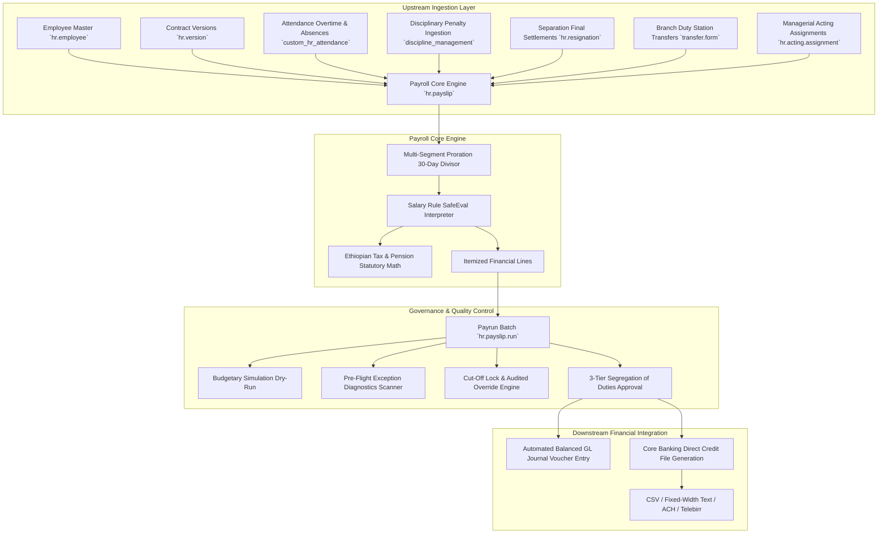
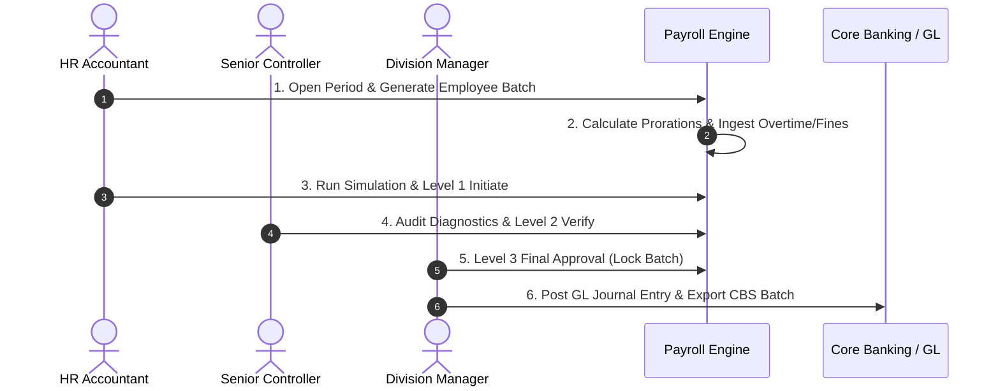

# Enterprise Payroll Processing & Compensation Management System
# End-to-End Technical and Functional User Guide

---

## Document Metadata
- **System**: Odoo 19 Community Edition ERP
- **Module Name**: `payroll` (Technical Addon Path: `custom_addons/payroll`)
- **Category**: Human Resources / Compensation & Benefits
- **Statutory Standard**: Ethiopian Tax & Social Security Legal Framework
- **Accounting Divisor**: 30-Day Commercial Banking Standard
- **Document Version**: 2.0 (Production Release)

---

## Table of Contents
1. [Executive Overview & System Architecture](#1-executive-overview--system-architecture)
2. [Security, Governance & Role-Based Access Control (RBAC)](#2-security-governance--role-based-access-control-rbac)
3. [Statutory Ethiopian Tax & Social Security Engine](#3-statutory-ethiopian-tax--social-security-engine)
4. [End-to-End Functional User Guide (Step-by-Step Operations)](#4-end-to-end-functional-user-guide-step-by-step-operations)
   - [Phase 1: Period Setup & Cut-Off Configuration](#phase-1-period-setup--cut-off-configuration)
   - [Phase 2: Payrun Batch Creation & Employee Ingestion](#phase-2-payrun-batch-creation--employee-ingestion)
   - [Phase 3: Multi-Segment Proration Time-Slicing](#phase-3-multi-segment-proration-time-slicing)
   - [Phase 4: Upstream ERP Payload Synchronization](#phase-4-upstream-erp-payload-synchronization)
   - [Phase 5: Managerial Acting Allowance Lifecycle](#phase-5-managerial-acting-allowance-lifecycle)
   - [Phase 6: Retroactive Adjustments (Arrears & Recoveries)](#phase-6-retroactive-adjustments-arrears--recoveries)
   - [Phase 7: Pre-Flight Diagnostics & Dry-Run Simulation](#phase-7-pre-flight-diagnostics--dry-run-simulation)
   - [Phase 8: 3-Tier Approval Workflow Execution](#phase-8-3-tier-approval-workflow-execution)
   - [Phase 9: Post-Cutoff Audited Override Management](#phase-9-post-cutoff-audited-override-management)
   - [Phase 10: General Ledger (GL) Accounting Integration](#phase-10-general-ledger-gl-accounting-integration)
   - [Phase 11: Core Banking System (CBS) Direct Credit Disbursement](#phase-11-core-banking-system-cbs-direct-credit-disbursement)
5. [Technical Architecture & Data Dictionary](#5-technical-architecture--data-dictionary)
6. [Salary Rule Engine Context & Custom Rule Authoring](#6-salary-rule-engine-context--custom-rule-authoring)
7. [Automated Scheduled Tasks (Cron Jobs)](#7-automated-scheduled-tasks-cron-jobs)
8. [Reporting Suite & Dashboard Guide](#8-reporting-suite--dashboard-guide)
9. [Audit Trail Ledger & Diagnostics Troubleshooting](#9-audit-trail-ledger--diagnostics-troubleshooting)

---

## 1. Executive Overview & System Architecture

The **Enterprise Payroll Processing and Compensation Management System** is an effective-date-driven, multi-tier governed payroll engine designed to process complex commercial banking payrolls.



### Key Architectural Tenets
1. **Effective-Date Anchoring**: Every financial computation is bounded by verified start, transfer, promotion, or separation effective dates.
2. **Commercial Banking 30-Day Divisor**: Prorated time slices calculate daily rates based on a standardized 30-day accounting month regardless of whether the calendar month contains 28, 29, 30, or 31 days.
3. **Single Source of Truth**: Eliminates manual spreadsheets by ingesting attendance, disciplinary actions, and resignation dues directly through programmatic database payloads.
4. **Segregation of Duties (SoD)**: Enforces strict role isolation between operational computation, controller verification, and executive division approval.

---

## 2. Security, Governance & Role-Based Access Control (RBAC)

The system organizes permissions across five specialized security groups registered in the Odoo 19 ACL framework:

| Security Group | Technical XML ID | Key Permissions & Responsibilities |
| :--- | :--- | :--- |
| **Officer / HR Accountant** | `payroll.group_payroll_user` | Creates and recomputes payslips, generates employee batch drafts, runs dry-run simulations, submits Level 1 payrun initiation, requests post-cutoff overrides. |
| **Senior Payroll Controller** | `payroll.group_payroll_verifier` | Performs Level 2 payrun verification, reviews variance reports, evaluates exception flags, rejects anomalies back to draft for remediation. |
| **Division Manager / Approver** | `payroll.group_payroll_manager` | Grants Level 3 Final Approval, authorizes post-cutoff exception overrides, locks periods, releases GL journal entries, authorizes CBS payment batches. |
| **Payroll Auditor (Read Only)** | `payroll.group_payroll_auditor` | Read-only inspection across all historical payslips, compensation audit logs, tax reports, and parameter configuration. |
| **Payroll Administrator** | `payroll.group_payroll_admin` | Full superuser authority over salary structures, rules, periods, override approvals, system parameters, and batch disbursements. Inherited automatically by `base.group_system`. |

### Record-Level Multi-Company & Self-Service Rules
- **Multi-Company Filtering**: Ensures payroll officers and managers only view payslips, periods, and batches belonging to their authorized company operating branch.
- **Employee Self-Service Rule**: Regular employees (`base.group_user`) can only view their own personal payslips, and only after the payrun state is `done` (Approved) or `paid` (Disbursed).

---

## 3. Statutory Ethiopian Tax & Social Security Engine

The salary rule engine natively computes Ethiopian statutory tax and pension contributions:

### 1. Social Security Pension Contributions (POESSA / PSSSA)
- **Employee Pension (`PENS_EE`)**:
  $$\text{Employee Pension} = \text{Prorated Gross Basic Salary} \times 7\%$$
  *(Statutorily exempt from personal income tax deduction).*
- **Employer Pension (`PENS_ER`)**:
  $$\text{Employer Pension} = \text{Prorated Gross Basic Salary} \times 11\%$$
  *(Bank operational expense ledgered to Social Security Authority Payable).*
- **Total Statutory Remittance**: $18\%$ ($7\% + 11\%$).

### 2. Progressive Personal Income Tax (PIT) Schedule
Taxable Income is derived as:
$$\text{Taxable Income} = \text{Gross Earnings} - \text{Non-Taxable Allowances} - \text{Employee Pension (7\%)}$$

The statutory Ethiopian personal tax brackets are evaluated as follows:

| Monthly Taxable Income (ETB) | Marginal Tax Rate | Statutory Deductible Step (ETB) | Mathematical Formula Applied |
| :--- | :---: | :---: | :--- |
| **0.00 – 600.00** | $0\%$ | $0.00$ | $\text{Tax} = 0.00$ |
| **601.00 – 1,650.00** | $10\%$ | $60.00$ | $\text{Tax} = (\text{Taxable} \times 0.10) - 60.00$ |
| **1,651.00 – 3,200.00** | $15\%$ | $142.50$ | $\text{Tax} = (\text{Taxable} \times 0.15) - 142.50$ |
| **3,201.00 – 5,250.00** | $20\%$ | $302.50$ | $\text{Tax} = (\text{Taxable} \times 0.20) - 302.50$ |
| **5,251.00 – 7,800.00** | $25\%$ | $565.00$ | $\text{Tax} = (\text{Taxable} \times 0.25) - 565.00$ |
| **7,801.00 – 10,900.00** | $30\%$ | $955.00$ | $\text{Tax} = (\text{Taxable} \times 0.30) - 955.00$ |
| **Over 10,900.00** | $35\%$ | $1,500.00$ | $\text{Tax} = (\text{Taxable} \times 0.35) - 1,500.00$ |

### 3. Statutory Allowance Exemptions
- **Transportation Allowance**: Non-taxable up to a legal statutory cap of $2,200.00\text{ ETB}$ per month. Any allowance amount exceeding this threshold is automatically grouped into taxable earnings.

---

## 4. End-to-End Functional User Guide (Step-by-Step Operations)



### Phase 1: Period Setup & Cut-Off Configuration
1. Navigate to **Payroll $\rightarrow$ Configuration $\rightarrow$ Payroll Periods**.
2. Click **New** and define:
   - **Period Name**: e.g., `September 2026 Commercial Payroll Cycle`
   - **Period Start Date**: `2026-09-01`
   - **Period End Date**: `2026-09-30`
   - **Cut-Off Date**: `2026-09-20` (Determines the hard cutoff for HR actions).
3. Click **Open Period**. The period is now active for data synchronization.

### Phase 2: Payrun Batch Creation & Employee Ingestion
1. Navigate to **Payroll $\rightarrow$ Payroll Operations $\rightarrow$ Batch Payruns**.
2. Click **New**:
   - Select the active **Payroll Period**.
   - Select the default **Salary Structure** (`Standard Ethiopian Bank Salary Structure`).
3. Click **Generate Payslips by Employees Wizard**:
   - Filter employees by Department, Operating Unit, or select all active bank staff.
   - Click **Generate Payslips**. The system batch-creates draft payslips for all chosen employees.

### Phase 3: Multi-Segment Proration Time-Slicing
The engine automatically detects lifecycle events during computation:
- **Mid-Month Joiners**: If Marta joins on September 16, worked days $= (30 - 16 + 1) = 15$ days. The proration factor is $\frac{15}{30} = 0.5$. Basic wage and recurring allowances are computed at exactly $50\%$.
- **Mid-Month Branch Transfer (Hardship Zone Changes)**: If an employee transfers on September 11 from Addis Ababa (HQ - 0% Hardship) to Assosa Branch (Tier 1 - 30% Hardship):
  - **Segment 1 (Sept 1–10)**: 10 Days at Standard Rate (0% Hardship).
  - **Segment 2 (Sept 11–30)**: 20 Days at Assosa Rate (30% Hardship).
  - Prorated earnings and hardship benefits are computed for each non-overlapping slice.

### Phase 4: Upstream ERP Payload Synchronization
- **Attendance & Overtime (`custom_hr_attendance`)**: Overtime records (Normal 1.5x, Weekend 2.0x, Holiday 2.5x) and unauthorized absences are pulled automatically from `attendance.payroll.payload`.
- **Disciplinary Penalties (`discipline_management`)**: Approved disciplinary case fines, salary withholdings, and unpaid suspensions are pulled from `discipline.payroll.penalty`.
- **Separation Settlements (`hr_resignation`)**: Accrued untaken annual leave and severance compensations are ingested into final settlement payslips.

### Phase 5: Managerial Acting Allowance Lifecycle
1. Navigate to **Payroll $\rightarrow$ Lifecycle Adjustments $\rightarrow$ Acting Assignments**.
2. When an employee is assigned to act in a higher managerial vacancy:
   - **Month 1 (Days 1–30)**: Evaluation buffer period $\rightarrow$ 0% payout.
   - **Months 2 to 6 (Days 31–180)**: Full differential payout $\rightarrow$ 100% of grade difference or fixed allowance.
   - **Month 7+ (Day 181+)**: Exceeded duration $\rightarrow$ System ceases allowance payment automatically and flags an executive appointment notice.

### Phase 6: Retroactive Adjustments (Arrears & Recoveries)
1. Navigate to **Payroll $\rightarrow$ Lifecycle Adjustments $\rightarrow$ Retroactive Adjustments**.
2. Click **New** and specify the employee, reason (e.g. Backdated Promotion), and effective date.
3. Click **Compute Retroactive Diff**:
   - The engine opens locked historical payslips back to the effective date.
   - Recalculates what the payslips should have been under the new salary.
   - Calculates the net difference:
     - Positive delta $\rightarrow$ **Retroactive Arrears** (`RETRO_ARREARS`).
     - Negative delta $\rightarrow$ **Retroactive Recovery** (`RETRO_RECOVER`).
4. Upon approval, these arrears/recoveries are automatically injected into the current active pay cycle.

### Phase 7: Pre-Flight Diagnostics & Dry-Run Simulation
1. On the Batch Payrun form, click **Run Simulation Dry-Run**.
   - Calculates projected gross, net, tax, and pension figures.
   - Compares metrics with the previous finalized payrun.
2. Review the **Diagnostics & Exceptions** tab:
   - Evaluates negative net pay, missing bank account numbers, missing TIN, and salary variances exceeding $25\%$.
   - **Critical Blockers** must be resolved before Level 2 / Level 3 approvals can proceed.

### Phase 8: 3-Tier Approval Workflow Execution
1. **Level 1 (Initiation)**: HR Accountant clicks **Level 1: Initiate (HR Accountant)**. The status shifts to `initiated`.
2. **Level 2 (Verification)**: Senior Payroll Controller reviews totals and variance diagnostics, then clicks **Level 2: Verify (Senior Controller)**. Status shifts to `verified`.
3. **Level 3 (Final Approval)**: Division Manager reviews the batch and clicks **Level 3: Final Approval (Division Manager)**.
   - Status shifts to `approved`.
   - All payslips are locked against modification.

### Phase 9: Post-Cutoff Audited Override Management
If an emergency salary change occurs after the cut-off date is locked:
1. Navigate to **Payroll $\rightarrow$ Audit & Diagnostics $\rightarrow$ Cut-Off Overrides**.
2. Submit an override request with the business justification and financial impact.
3. The Division Manager must review and click **Approve Override** before the payslip can be adjusted.

### Phase 10: General Ledger (GL) Accounting Integration
1. On the approved Payrun form, the Division Manager clicks **Post Accounting to GL**.
2. The engine generates a balanced double-entry Journal Voucher:
   - **Debit**: Basic Salary Expense, Housing Allowance Expense, Transport Expense, Overtime Expense, Employer Pension Expense (11%).
   - **Credit**: Personal Income Tax Withholding Payable, Social Security Pension Payable (18%), Staff Loan Recovery, Net Salary Payable.

### Phase 11: Core Banking System (CBS) Direct Credit Disbursement
1. On the approved Payrun form, click **Generate CBS Direct Credit Batch**.
2. Select the target disbursement protocol:
   - **CBS Standard CSV**: Standard format with Employee ID, Account Number, Amount, and Reference.
   - **Core Banking Fixed-Width Text**: Formatted for mainframe banking systems.
   - **Direct Credit ACH**: National Automated Clearing House file.
   - **Telebirr Bulk Payroll Disburse**: Formatted for mobile wallet disbursement.
3. Click **Generate & Validate Export**:
   - The engine validates 13-digit Ethiopian bank account formats.
   - Computes checksum totals and generates the encrypted downloadable file.

---

## 5. Technical Architecture & Data Dictionary

### Key Database Models in `custom_addons/payroll`

```
custom_addons/payroll/
├── models/
│   ├── hr_payroll_period.py         -> Defines payroll accounting periods & cut-off enforcement
│   ├── hr_salary_rule_category.py   -> Rule category hierarchy (BASIC, ALW, GROSS, STAT_DED, NET)
│   ├── hr_salary_rule.py            -> SafeEval calculation rules and conditions
│   ├── hr_payroll_structure.py      -> Bundles salary rules with parent-child inheritance
│   ├── hr_payslip.py                -> Core calculation engine, proration and upstream ingestion
│   ├── hr_payslip_line.py           -> Itemized rule computation results per payslip
│   ├── hr_payslip_input.py          -> Variable inputs (bonuses, overtime hours, manual deductions)
│   ├── hr_payslip_segment.py        -> Proration time slices (30-day divisor arithmetic)
│   ├── hr_payslip_run.py            -> Batch payrun and 3-tier approval state machine
│   ├── hr_hardship_allowance.py     -> Hardship tier definitions and employee eligibility audit ledger
│   ├── hr_acting_allowance.py       -> Managerial acting assignment duration monitor (1/2-6/7+ months)
│   ├── hr_payroll_retroactive.py    -> Backdated diff engine for historical arrears and recoveries
│   ├── hr_payroll_cutoff_override.py-> Post-cutoff audited exception override workflow
│   ├── hr_payroll_exception.py      -> Pre-flight variance and anomaly diagnostic scanner
│   ├── hr_payroll_audit_log.py      -> Immutable transaction change audit ledger
│   ├── payroll_gl_integration.py    -> General Ledger double-entry account mapping engine
│   ├── payroll_cbs_export.py        -> CBS/ACH/Telebirr direct credit payment file export
│   └── hr_employee_payroll_ext.py   -> Employee form extensions, smart buttons and tabs
```

---

## 6. Salary Rule Engine Context & Custom Rule Authoring

When salary rules are evaluated via `amount_python_compute`, the execution context provides the following sandbox variables:

| Variable | Description | Example Usage |
| :--- | :--- | :--- |
| `payslip` | Active `hr.payslip` record object | `payslip.get_approved_overtime_amount()` |
| `employee` | Active `hr.employee` record object | `employee.department_id.name` |
| `contract` | Active `hr.version` contract record | `contract.wage` or `contract.housing_allowance` |
| `rules` | Browsable dictionary of computed rules | `rules.BASIC.total` or `rules.TAXABLE.total` |
| `categories` | Browsable dictionary of category totals | `categories.BASIC + categories.ALW` |
| `inputs` | Dictionary of variable input amounts | `inputs.get('BONUS', 0.0)` |
| `segments` | RecordSet of proration time slices | `sum(s.prorated_basic_salary for s in segments)` |

---

## 7. Automated Scheduled Tasks (Cron Jobs)

The module registers four background cron jobs in `data/payroll_cron.xml`:

1. **Payroll: Enforce Monthly Cut-Off Locks** (`daily`): Scans open periods and automatically enforces the cut-off lock once the cut-off date is reached.
2. **Payroll: Monitor Acting Assignment Durations** (`daily`): Evaluates active managerial acting roles, transitioning assignments from Month 1 Buffer $\rightarrow$ Months 2–6 Active $\rightarrow$ Month 7+ Auto-Capped.
3. **Payroll: Ingest External ERP Payloads** (`hourly`): Polls pending attendance overtime, unauthorized absences, and disciplinary penalties into payroll inputs.
4. **Payroll: Pre-Flight Exception Scanner** (`daily`): Executes anomaly diagnostics across upcoming unfinalized payruns.

---

## 8. Reporting Suite & Dashboard Guide

### 1. Official Printable PDF Reports
- **Employee Payslip PDF** ([`payslip_report_template.xml`](file:///d:/odoo19/custom_addons/payroll/report/payslip_report_template.xml)): Professional payslip report with complete proration time-slice breakdown, earnings, statutory tax/pension lines, and net disbursement.
- **Payrun Batch Financial Summary** ([`payroll_summary_report.xml`](file:///d:/odoo19/custom_addons/payroll/report/payroll_summary_report.xml)): Batch-wide summary with aggregate basic, gross, tax, pension, and net totals.
- **Payroll Variance & Exception Audit Report** ([`payroll_variance_report.xml`](file:///d:/odoo19/custom_addons/payroll/report/payroll_variance_report.xml)): Highlights month-over-month salary shifts ($> 25\%$) and flagged diagnostic anomalies.
- **Statutory Tax & Pension Schedule** ([`statutory_tax_pension_report.xml`](file:///d:/odoo19/custom_addons/payroll/report/statutory_tax_pension_report.xml)): Official tax authority and pension agency remittance schedule with TIN, employee basic wage, 7% EE, and 11% ER pension amounts.

### 2. Interactive OWL Payroll Dashboard
Navigate to **Payroll $\rightarrow$ Dashboard** to view real-time KPI metrics, active payrun status, pending approvals, and quick actions for period management and batch runs.

---

## 9. Audit Trail Ledger & Diagnostics Troubleshooting

### Immutable Audit Trail Ledger (`hr.payroll.audit.log`)
Every critical payroll action is logged automatically with the timestamp, operator user ID, event type, affected employee, previous value, new value, and audit narrative:
- Payslip recomputations
- Payrun verification and approvals
- Cut-off override authorizations
- Retroactive arrears/recovery injections
- CBS file exports

### Common Diagnostic Flags & Remediation

| Exception Flag | Root Cause | Remediation Procedure |
| :--- | :--- | :--- |
| `missing_bank_account` | Employee master record has no bank account number. | Open the employee profile and enter the 13-digit bank account number. |
| `missing_tin` | Employee has no Tax Identification Number. | Update the employee's TIN field in the HR record. |
| `negative_net` | Deductions (disciplinary/absence/loans) exceed gross earnings. | Adjust deduction schedules or review penalty withholdings. |
| `high_variance` | Net pay shifted by $> 25\%$ compared to prior month. | Verify if a promotion, backdated increment, or acting allowance was recently applied. |
| `missing_contract` | Active employee has no confirmed contract version. | Create and confirm an active `hr.version` contract for the employee. |

---

## 10. Annual Salary Increment Campaign Management (Effective July 1)

In Ethiopian commercial banking practices, annual salary increments are legally and contractually anchored to **July 1 (Hamle 1)**. When board approvals occur in subsequent months (e.g., September or October), the system automatically versions employee contracts and computes exact backdated retroactive arrears.

### 1. Calculation Methodologies Supported
1. **Flat Multiplier / Factor (`flat_multiplier`)**:
   - Applies an approved salary multiplier or step factor (e.g., **1.5x standard basic step**) to all eligible staff.
   - Alternatively supports a flat percentage rate (e.g., 10% across-the-board increase).
2. **Grade Step Increment Matrix (`grade_step_cofactor`)**:
   - Computes increments dynamically based on each employee's job grade step table (`hr.job.grade` step amounts) multiplied by an approved grade cofactor.
3. **PMS Performance Rating Tier Matrix (`pms_performance`)**:
   - Scales the increment according to individual annual performance appraisal scores (e.g., PMS $\ge$ 120 $\rightarrow$ 2.0x step, PMS 100–119 $\rightarrow$ 1.5x step, PMS 85–99 $\rightarrow$ 1.25x step, PMS 75–84 $\rightarrow$ 1.0x step, PMS 50–74 $\rightarrow$ 0.5x step, PMS $<$ 50 $\rightarrow$ 0.0x step).

### 2. Business Rules & Eligibility Filters
- **Mid-Year Joiner Proration**: Automatically calculates service months prior to July 1 ($\frac{\text{Service Months}}{12}$).
- **Minimum Service Gate**: Staff with fewer than 3 months of service prior to July 1 receive 0% increment.
- **Active Disciplinary Sanction Filter**: Employees with active/unresolved disciplinary records (`discipline.case`) are automatically excluded from the increment campaign.

### 3. Dual-Mode Back-Increment Disbursement
When approval is granted $N$ months after July 1:
- **Mode A (Injected into Regular Monthly Payroll)**: Spawns verified `hr.payroll.retroactive` adjustment records. During the next regular payroll cycle, the salary rule `RETRO_ARREARS` automatically injects the accumulated arrears into the employee's monthly payslip.
- **Mode B (Dedicated "Back Increment" CBS Direct Credit Batch)**: Automatically spawns a standalone CBS payment batch (`payroll.payment.batch`) enabling immediate, out-of-cycle direct credit bank transfer of backdated arrears.

### 4. Step-by-Step Campaign Workflow
1. Navigate to **Payroll $\rightarrow$ Lifecycle Adjustments $\rightarrow$ Annual Salary Increment**.
2. Click **Create** and define Fiscal Year (e.g., `2025/2026`), Effective Date (`2025-07-01`), Approval Date, and Calculation Method.
3. Click **Compute Increment Lines** to generate individual employee increment amounts, prorations, and retroactive arrears.
4. Click **Verify Campaign** (Senior Compensation Controller).
5. Click **Approve Campaign** (HR Director / Executive Management).
6. Click **Apply & Disburse**:
   - Employee contracts (`hr.version`) and master basic salaries are updated automatically.
   - Arrears are either scheduled for monthly payroll injection or exported into a dedicated CBS batch.
   - An immutable audit trail entry is generated in `hr.payroll.audit.log`.
7. Click **Print PDF** to generate the executive increment campaign audit schedule.

---

## 11. Annual Performance Bonus Engine (Separate Payout — Option A)

Commercial banks in Ethiopia pay annual performance bonuses to staff based on institutional profitability and individual Performance Management System (PMS) appraisal ratings. In accordance with banking standards, bonus campaigns are disbursed **separately from regular monthly payroll** via dedicated CBS batches and GL journal postings.

### 1. PMS Rating Brackets & Multiplier Tiers
Bonuses are evaluated as multiples of basic monthly salary across seven strict performance appraisal rating tiers:

| PMS Score Bracket | Multiplier (Months of Basic Wage) | Performance Rating Level | Example (Basic 20,000 ETB) |
| :--- | :--- | :--- | :--- |
| **Above 150** | **3.50 Months** | Exceptional / Top Performer | $20,000 \times 3.50 = \text{ETB } 70,000$ |
| **120 – 150** | **2.75 Months** | Outstanding Performance | $20,000 \times 2.75 = \text{ETB } 55,000$ |
| **100 – 120** | **2.25 Months** | Exceeds Expectations | $20,000 \times 2.25 = \text{ETB } 45,000$ |
| **85 – 100** | **2.00 Months** | Meets Expectations *(e.g. PMS 91)* | $20,000 \times 2.00 = \text{ETB } 40,000$ |
| **75 – 85** | **1.25 Months** | Satisfactory Performance | $20,000 \times 1.25 = \text{ETB } 25,000$ |
| **50 – 75** | **0.50 Months** | Marginal / Needs Improvement | $20,000 \times 0.50 = \text{ETB } 10,000$ |
| **Below 50** | **0.00 Months** | Disqualified / Unsatisfactory | $20,000 \times 0.00 = \text{ETB } 0$ |

### 2. Ethiopian Tax & Pension Statutory Math for Bonuses
- **Personal Income Tax (PIT)**: Statutory progressive tax brackets apply to the full gross bonus amount. For example, on a gross bonus of 40,000 ETB (above 10,900 bracket), PIT is computed as $(40,000 \times 35\%) - 1,500 = \text{ETB } 12,500$.
- **Pension Exemption**: In accordance with POESSA regulatory guidelines, annual performance bonuses are strictly **exempt from pension deductions** (0% Employee, 0% Employer).
- **Net Bonus Payable**: Gross Bonus $-$ PIT Tax Withholding ($40,000 - 12,500 = \text{ETB } 27,500$).

### 3. General Ledger (GL) Balanced Journal Entry
Upon campaign disbursement, a balanced journal entry is posted automatically:
- **Debit**: Staff Bonus Expense Account (`bonus_expense_account_id`) — Gross Bonus Total
- **Credit**: PIT Tax Withholding Payable Account (`tax_payable_account_id`) — Total Tax Withheld
- **Credit**: Net Bonus Bank Clearing Account (`payable_account_id`) — Total Net Disbursed

### 4. Step-by-Step Bonus Campaign Workflow
1. Navigate to **Payroll $\rightarrow$ Lifecycle Adjustments $\rightarrow$ Annual Performance Bonus**.
2. Click **Create** and specify Fiscal Year (e.g., `2024/2025`), Evaluation Period, Declaration Date, and Tier Multipliers.
3. Click **Compute Bonus Schedules** to evaluate each employee's PMS rating, prorated days worked, gross bonus, PIT tax deduction, and net payable amount.
4. Click **Verify Schedule** (Finance & Compensation Review).
5. Click **Approve Bonus** (Board / Executive Committee Authorization).
6. Click **Post GL & Disburse CBS**:
   - Posts the balanced GL voucher entry.
   - Spawns the dedicated CBS Direct Credit Payment Batch (`payroll.payment.batch`).
   - Generates the ready-to-transmit CBS CSV / TXT direct credit file.
   - Logs immutable audit entries in `hr.payroll.audit.log`.
7. Click **Print PDF** to generate the official executive bonus disbursement schedule.
